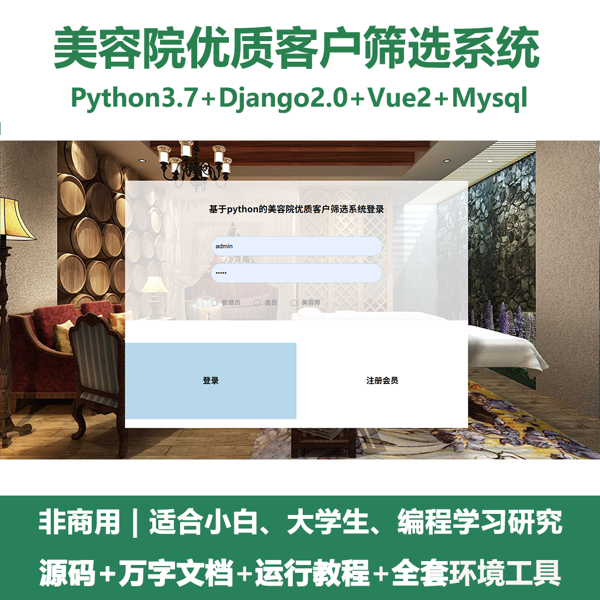
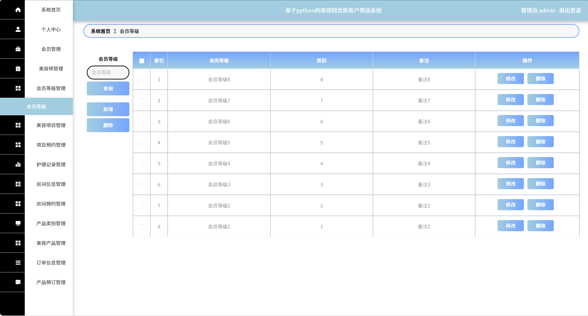
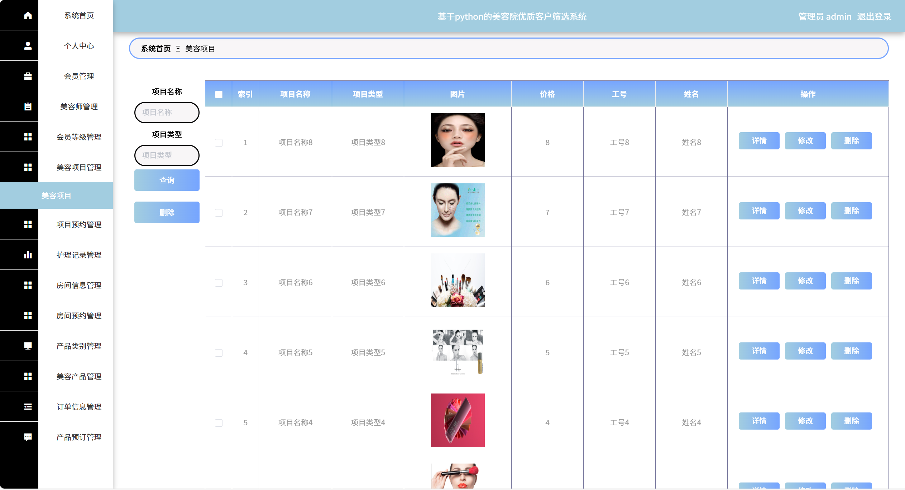
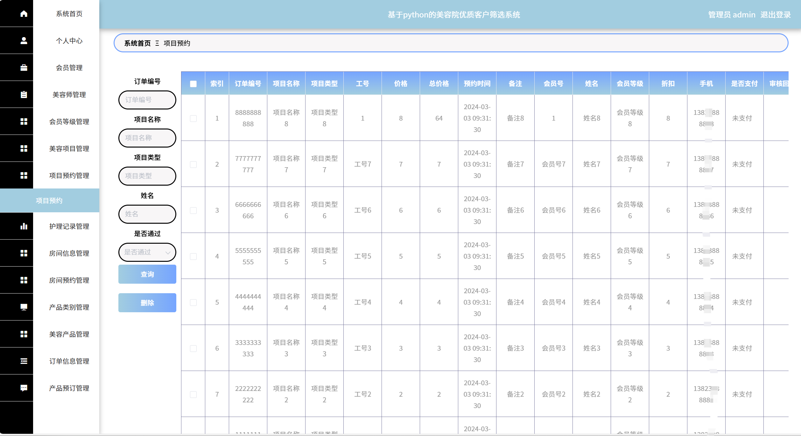
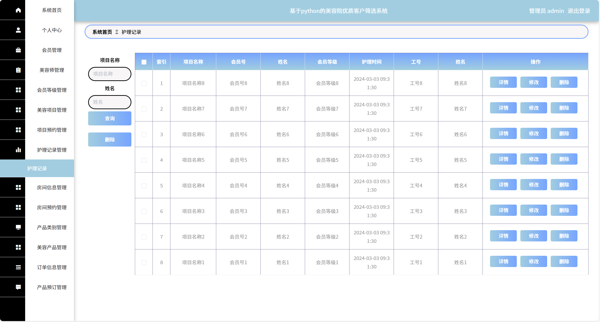
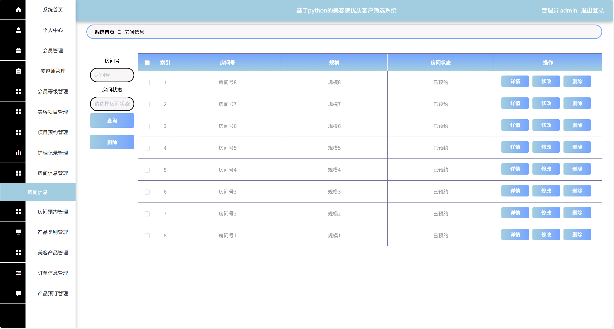
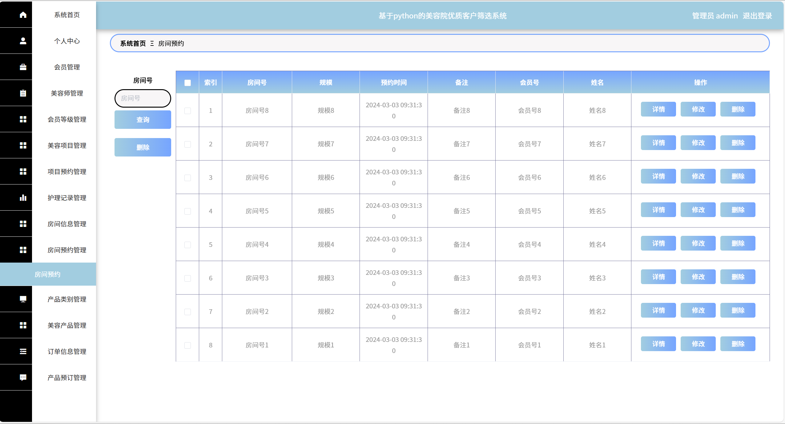
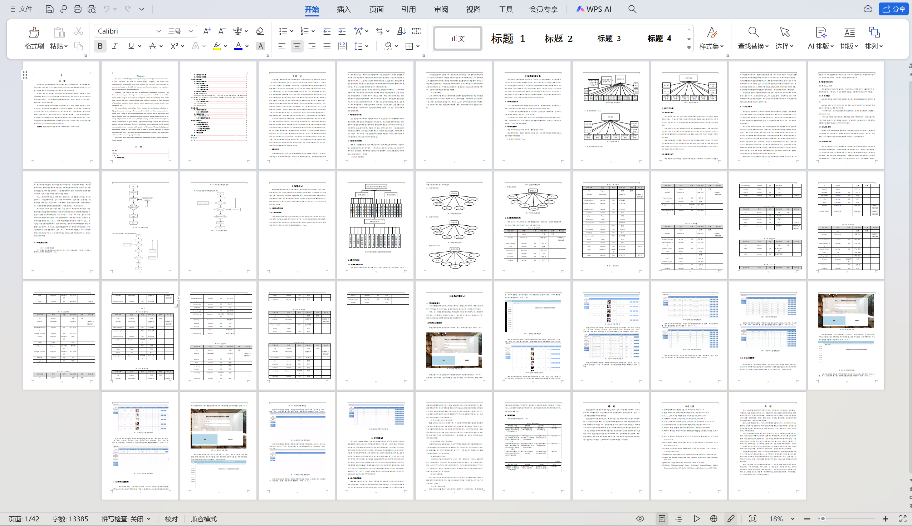

# python090
python090基于Python+Django的美容院优质客户筛选系统+LW
 
## 查看主页获取源码

### 一、关键词
美容院优质顾客甄选系统，美容院高端客户识别系统，美容院核心客户筛选系统

### 二、作品包含
源码+数据库+设计文档万字+全套环境和工具资源+本地部署教程

### 三、项目技术
前端技术：Vue2.0、Element-ui
后端技术：Python3.7、Django2.0

### 四、运行环境（以下版本亲测，其他版本兼容性请自行测试）
开发工具：PyCharm + VSCODE

数据库：MySQL5.7（最低要5.7版本）

数据库管理工具：Navicat10+

Python：Python3.7

前端Nodejs：14

浏览器：谷歌浏览器

### 五、项目介绍
项目编号：python090

悦己美容院后台管理系统的目的是让使用者可以更方便的将人、设备和场景更立体的连接在一起。能让用户以更科幻的方式使用产品，体验高科技时代带给人们的方便，同时也能让用户体会到与以往常规产品不同的体验风格。
与安卓，iOS相比较起来，悦己美容院后台管理系统在流畅性，续航能力，等方方面面都有着很大的优势。这就意味着悦己美容院后台管理系统的设计可以比其他系统更为出色的能力，可以更高效的完成最新的美容师、会员、美容项目、项目预约、护理记录、房间信息等功能。

### 六、运行截图

